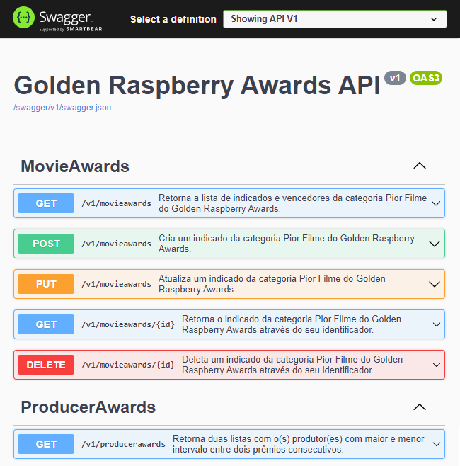

# golden.raspberry.awards.api
Projeto Web API RESTful nível 2 com base no modelo Richardson de maturidade.

# Objetivo do projeto
- Ler uma arquivo CSV, armazenar informações em um banco de dados embarcado na memória.
- Obter o produtor com maior intervalo entre dois prêmios consecutivos.
- Obter o produtor que obteve dois prêmios mais rápidamente.

### Desenvolvido com
- Microsoft Visual Studio Community 2019 - IDE
- .Net 3.1 - Plataforma de execução
- C# - Linguagem de programação
- Sqlite - Banco de dados (em memória)
- NUnit - Framework de testes
- Swagger - Documentação API

## Execução do projeto
Clonar repositório
```
git clone https://github.com/
```
- Abrir a solução 'golden.raspberry.awards.sln' em sua IDE.
- Compilar e executar a solução.

- Utilizar o browser para chamar o recurso principal do controlador ProducerAwars:
```
curl https://localhost:44331/producerawards
```
- Ou utilizar a chamada diretamente pela interface do Swagger:


## Execução dos testes de integração
- Executar os testes de integração através do Test Explorer do Visual Studio.
- Verificar se todos os testes foram executados com sucesso.

## Recurso principal - Controlador ProducerAwards

**Endpoint:** GET

**URL:** /producerawards

**Exemplo de resposta:**
```javascript
{
	"min": [{
		"producer": "Bo Derek",
		"interval": 6,
		"previousWin": 1984,
		"followingWin": 1990
	}],
	"max": [{
		"producer": "Bo Derek",
		"interval": 6,
		"previousWin": 1984,
		"followingWin": 1990
	}]
}
```

## Recursos disponiveis

